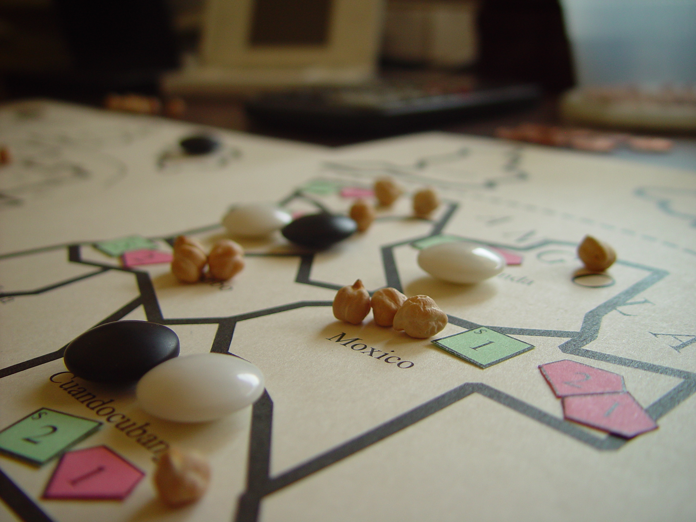
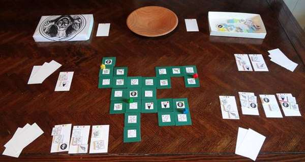
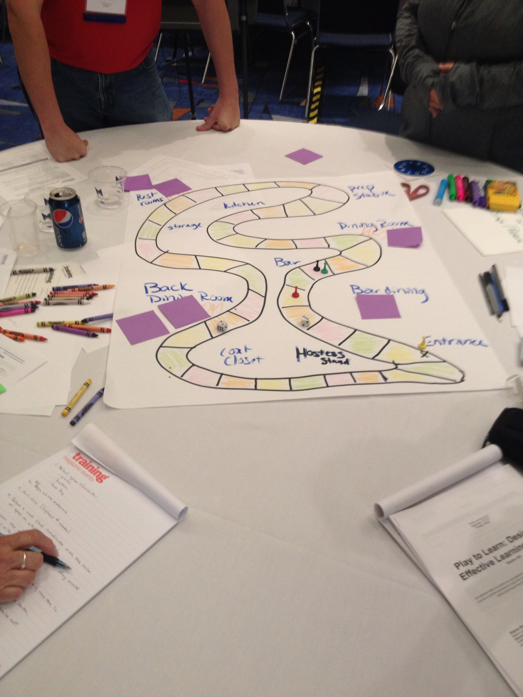

#### Der Prototyp

- Fügen Sie hier Sketches und Fotos ihres Prototypen ein und dokumentieren Sie ihr Spiel so, dass man die Spielidee nachvollziehen und verstehen kann, wie das Gameplay funktioniert
- Schreiben Sie über ihre Erfahrungen beim Spielen. Hat Ihnen das Spiel Spass gemacht. 
- Erklären Sie, was ihnen beim entwickeln des Prototypen am meisten gebracht hat? War es schwerer oder einfacher als gedacht? Welche / wieviele Iterationen mussten Sie machen, um die Idee zu einem funktionierenden / spielbaren Prototypen umzubauen?

__Weiteres entnehmen Sie bitte dem Übungsblatt!__

Beispielbilder:

