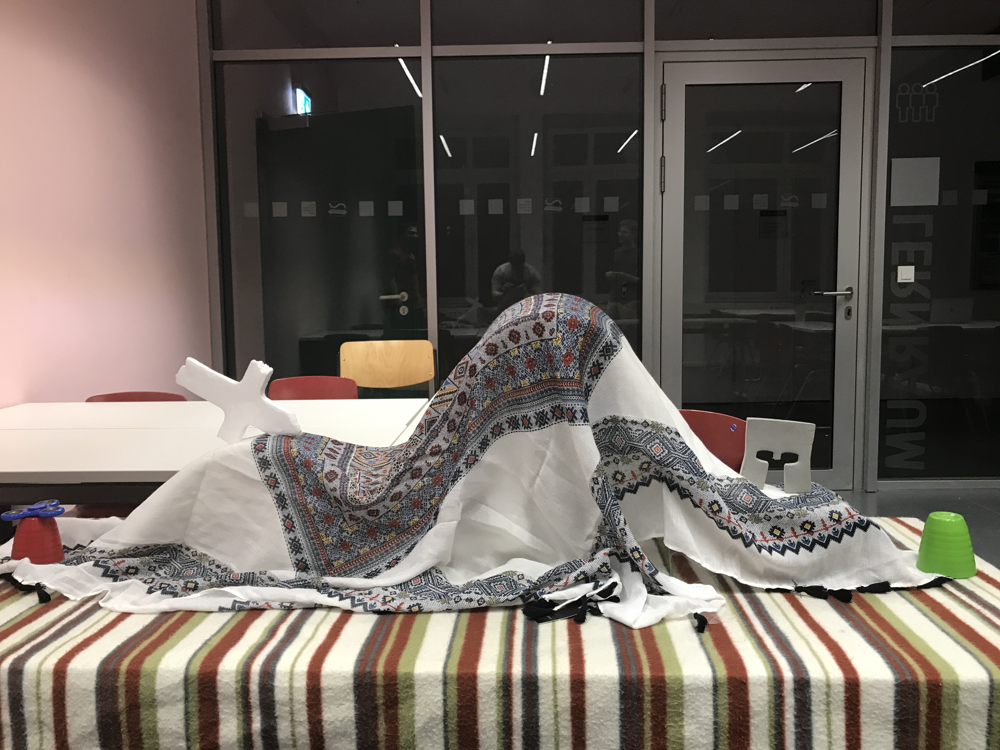

#### Der Prototyp

- Fügen Sie hier Sketches und Fotos ihres Prototypen ein und dokumentieren Sie ihr Spiel so, dass man die Spielidee nachvollziehen und verstehen kann, wie das Gameplay funktioniert
- Schreiben Sie über ihre Erfahrungen beim Spielen. Hat Ihnen das Spiel Spass gemacht. 
- Erklären Sie, was ihnen beim entwickeln des Prototypen am meisten gebracht hat? War es schwerer oder einfacher als gedacht? Welche / wieviele Iterationen mussten Sie machen, um die Idee zu einem funktionierenden / spielbaren Prototypen umzubauen?

__Weiteres entnehmen Sie bitte dem Übungsblatt!__

Wir haben einen ganzen Tag damit verbracht an unserem physischen Prototypen zu arbeiten.
Dazu hat jeder Materialien mitgebracht, größtenteils Dinge die wir Zuhause rumliegen hatten.
Uns war bereits klar, dass wir die Waffen und Aktionen, die bei unserem Spiel zum Einsatz kommen, durch Karten darstellen. Unsere 2D-Map haben wir improvisiert, sie sah wie folgt aus:

&nbsp
Für die Einheiten haben wir Gogo's verwendet. Wir haben schnell gemerkt, dass wir für unser Spiel ein anderes Größenverhältnis benötigen. Die Map sollte größer sein und den Gloomys mehr Raum bieten. Der Grobe Spielablauf läuft wie folgt ab. Es gibt 3 Fraktionen auf einer 2D-Map die gegeneinander antreten. Jede Fraktion besitzt 3 Einheiten, die zufällig auf der Map verteilt spawnen. Das Spiel ist rundenbasiert, eine Einheit kann zu beginn zwischen verschiedenen Aktionen wählen, die unterschiedlich viele Aktionspunkte kosten. Hier einige Beispielmöglichkeiten: 
&nbsp
Ein Gloomy kann sich beispielsweise für einen Schläger im Nahkampf entscheiden

&nbsp
Ein sicherer Treffer, der dem Feind noch zusätzlichen Fallschaden hinzufügt

&nbsp
Ein Gloomy kann solange Aktionen durchführen bis seine Aktionspunkte aufgebraucht sind.
Mehrere Angriffe sind damit auch möglich. Zu Beginn ist die Anzahl der Aktionspunkte noch gering, sie steigt jedoch im Verlaufe des Spiels über Zeit und durch LvlUps.
Nach beenden des Zuges ist der nächste Gloomy einer anderen Fraktion an der Reihe.
Erfolgreiche Treffer mithilfe von Waffen geben Gloomys Erfahrung, wodurch sie ein Level aufsteigen können und zwischen verschiedenen Upgrades auswählen können.
Beispiel-Upgrades 
&nbsp
Zusätzlich landen auf der Map auch manchmal Luftunterstützungskisten, die wertvolle Objekte beinhalten

&nbsp
Beim Einsammeln erkennt man erst den wahren Wert einer Kiste

&nbsp

Wir hatten viel Spaß beim Basteln, da man kreativ mit seinen Materialien umgehen musste.
Interne Streitigkeiten wurden stets auf diplomatischem Wege gelöst 
&nbsp
Einen großen Aspekt des Spiels, den wir noch nicht genug durchdacht hatten, war das Schadens System im Zusammenspiel mit den Lvling-Möglichkeiten. Wir habens uns dazu die ersten verschiedenen Waffentypen ausgedacht und uns auf erste provisorische Werte für den Schaden der Waffen sowie der Lebenspunkte(25) von den Gloomys geeignigt. 
Grundsätzlich ist das Zusammenspiel der ganzen Elemente für uns die größte Herausforderung.
Wie genau unsere Fähigkeiten beim Lvl-Up aussehen, können wir erst entscheiden wenn die Basis fürs Spiel steht und wir ein Gefühl für unser Gameplay haben. Wie sich das Gameplay im Laufe des Spiels entwickelt hängt von vielen verschiedenen Faktoren ab, daher wird die Entwicklung des Spiels aufbauend verlaufen. Das heißt wir werden Stück für Stück weitere Elemente ins Spiel einbauen und darauf achten wie der Spielfluss sich ändert. Es kann sich daher noch vieles während der Entwicklung tun. Beispielsweise haben wir die Upgrades beim LvlUp momentanen noch sehr einfach gehalten. Die Powerups sollen später weitaus ausgereifter und kreativer sein.

