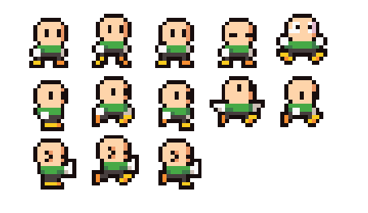
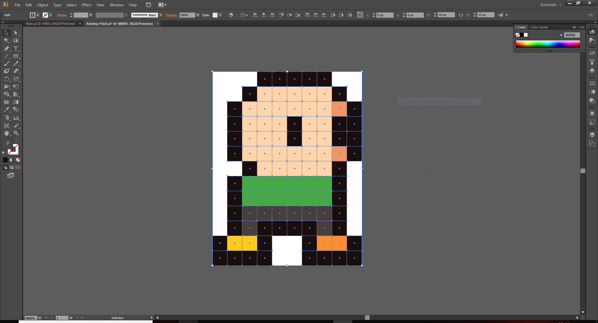
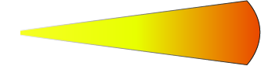
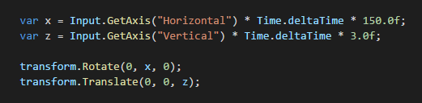
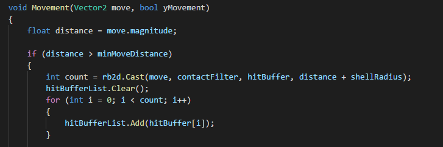
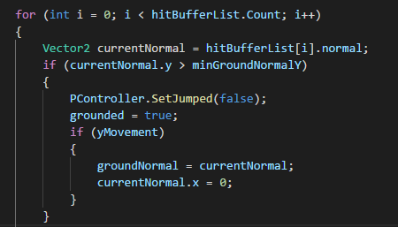
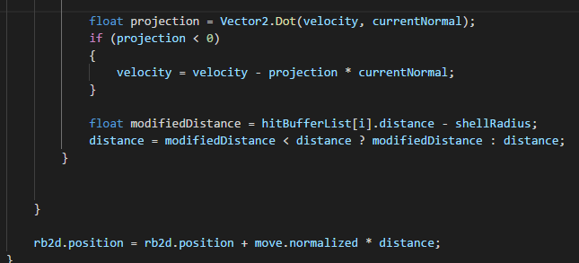

## Zwischenbericht

Wir haben bisher Layer1 und einige Elemente aus Layer2 implementiert.

### Layer1:

#### Die Einheit:
  Als erstes haben wir eine einzelne Einheit erstellt. Dazu haben wir uns ein kostenloses Sprite-Sheet aus dem
  AssetStore heruntergeladen, welches uns auch Animationen ermöglicht.
  
 
 
  Diese dient als Platzhalter, bis wir sie für die einzelnen Fraktionen noch etwas anpassen.
  
#### Ziel- und Schießsystem:
  Für das Ziel und Schießsystem haben wir unsere Einheit durch ein neues Bild erweitert, welches in Illustrator nachgebaut
  wurde. Die Hände wurden entfernt und an die einzelnen Waffen angefügt.
   
  
  Desweiteren mussten wir hier viele kleinerer Komponenten beachten wie: Rotation, Charackterspiegelelung und Feurposition des
  Projektils.
  
  Als nächstes brauchten wir eine Animation für das Aufladen des Projektilschusses. Da wir Online keine passende Hilfe gefunden 
  haben, haben wir in Illustrator zwei Bilder erstellt. Eine leere Hülle und ein Bild welches beim Aufladen gleichmäßig
  gescaled wird. Dadurch ergibt sich ein Aufladeffekt.
  
   
  
  
#### Player Movement:

 Das Player Movement hatten wir zu beginn sehr einfach implementiert:
 

 Das hat für die erste Zeit gereicht, jedoch haben wir gemerkt dass es einige Probleme gab, 
 die Bewegung hat sich merkwürdig angefühlt und das erklimmen von hohen Klippen war 
 "zu einfach", außerdem haben wir informationen benötigt wie zum Beispiel ob wir gerade 
 "grounded" sind um Mehrfachsprünge zu verhindern,  Sprunganimationen einzuführen etc.
 Daher haben wir das Movement-Script nach einem recht ausführlichen Unity Tutorial aufgebaut 
 und es ist etwas komplizierter als erwartet geworden.
 
 Dazu haben wir erstmal ein eigenes Physics Object erstellt, von dem der Playercontrollererbt.  
 Die wichtigste Funktion für die Bewegung  ist die Movement Funktion in dem Physics Object:
 
 
 hierbei wird zuerst geschaut ob die mögliche Bewegung groß 
 genug ist um gemacht zu werden. Wenn ja wird mit rb2d.Cast() 
 geschaut ob es während dieser Bewegung zu hits kommen wird. 
 Falls es hits gibt werden diese in einer Hitbufferliste
 zwischengespeichert. Mithilfe dieser sehen wir dann auch ob wir 
 "grounded" sind, also ob wir mit einem Objekt colliden ,dass 
 eine gewisse Steigung nicht übersteigt.
 
 
 
 
 Zum Schluss wird die neue Position berechnet und angewandt.
 
 
 ### Layer 2:
 
 ####  Audio:
 Das hinzufügen von Hintergrundsounds und Soundeffekten ging recht einfach.
 Dabei haben wir uns am Anfang an das Soundcontroller Script, 
 welches wir für unser erstes Breakout Spiel erstellt  hatten. 
 Das erlaubte es uns einfache Sounds abzuspielen, man 
 merkte aber schnell, dass störend ist immer wieder den gleichen 
 Soundeffekt zu hören wenn man zum Beispiel getroffen wird. 
 Deshalb haben wir das Script um eine Funktion RandomizeSfx() erweitert, 
 die zum Beispiel beim hintereinander Getroffen werden  zwischen 
 zufälligen verschiedenen Sounds wechselt und dabei auch eine kleine 
 Varianz in die höhe vom Pitch bringt.
 
 
 ##### Voice Acting:
 Die Stimmen der einzelnen Fraktionen haben wir selbst eingesprochen. Dabei haben wir
 hauptsächlich Auda City für die Aufnahmen benutzt. 

 

  
