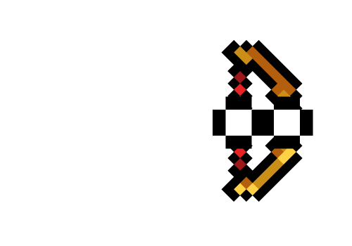

## Zwischenbericht

Wir haben bisher Layer1 und einige Elemente aus Layer2 implementiert.

### Layer1:

#### Die Einheit:
  Als erstes haben wir eine einzelne Einheit erstellt. Dazu haben wir uns ein kostenloses Sprite-Sheet aus dem AssetStore
  heruntergeladen, welches uns auch Animationen ermöglicht.
  
  
  
  
 
  Diese dient als Platzhalter, bis wir sie für die einzelnen Fraktionen noch etwas anpassen.
  &nbsp;
  
#### Ziel- und Schießsystem:
  Für das Ziel und Schießsystem haben wir unsere Einheit durch ein neues Bild erweitert, welches in Illustrator nachgebaut
  wurde. Die Hände wurden entfernt und an die einzelnen Waffen angefügt.
   
  
  Desweiteren mussten wir hier viele kleinerer Komponenten beachten wie: Rotation, Charakterspiegelelung und Feurposition des
  Projektils.
  
  Als nächstes brauchten wir eine Animation für das Aufladen des Projektilschusses. Da wir Online keine passende Hilfe gefunden 
  haben, haben wir in Illustrator zwei Bilder erstellt. Eine leere Hülle und ein Bild welches beim Aufladen gleichmäßig
  gestreckt wird. Dadurch ergibt sich ein Aufladeffekt.
  
  
  
   
  
  Hier haben sich sehr viele Komplikationen bemerkbar gemacht. Manchmal hat sich der Player nicht richtig gedreht. Die Waffe
  musste an der Y-Achse gespiegelt werden. Zunächst hatten wir die Flip funktion benutzt, jedoch sind wir dann auf die
  Invertierung der TransformX-Achse umgestiegen, da somit auch alle anderen Komponenten gespiegelt werden. Hier mussten auch
  viele Anpassungen gemacht werden, als wir den Movement- und Aiming-Button hinzugefügt haben. 
  &nbsp;
  
#### 2D-Map
  Für unsere erste Map haben wir uns ein PNG aus dem Internet runtergeladen, welches aus mehreren Layern besteht. 
  So haben wir die vordersten Berge als Spiel-Terrain benutzt, in dem wir zum vorderen Layer-Sprite einen Collider hinzugefügt haben.
  Die jetzige Map verwenden wir jedoch nur vorrübergehend, da sie zu klein und insgesamt zu flach ist. 
  Sie wäre für eine längere Runde, die sich über mehrere Minuten erstreckt, ungeeignet.
  
  &nbsp;
  
#### GameManager
  Den GameManager haben wir eingebaut, nachdem das Ziel-Waffensystem und der Player bereits erstellt waren. Dieser instanziert
  die Player. Hier war das bisher Aufwendigste die Player nacheinander spielen zulassen. Nach jedem Schuss ist die Runde
  einer Einheit beendet. Wir mussten den Turnmanager so programmieren, dass er wartet, bis das Projektil zerstört ist, damit 
  keine gleich sterbende Einheit dran ist, die dann nicht mehr agieren kann. Außerdem mussten wir die Einheiten richtig aus
  dem Spiel nehmen, damit eine korrekt Reihenfolge gewährleistet ist. Viele andere Scripts wurden erweitert, damit wir die
  Player passiv stellen können, wenn sie nicht an der Reihe sind.
  &nbsp;
  
#### Player Movement:

 Das Player Movement hatten wir zu beginn sehr einfach implementiert:
 

 Das hat für die erste Zeit gereicht, jedoch haben wir gemerkt dass es einige Probleme gab, 
 die Bewegung hat sich merkwürdig angefühlt und das erklimmen von hohen Klippen war 
 "zu einfach", außerdem haben wir informationen benötigt wie zum Beispiel ob wir gerade 
 "grounded" sind um Mehrfachsprünge zu verhindern,  Sprunganimationen einzuführen etc.
 Daher haben wir das Movement-Script nach einem recht ausführlichen Unity Tutorial aufgebaut 
 und es ist etwas komplizierter als erwartet geworden.
 
 Dazu haben wir erstmal ein eigenes Physics Object erstellt, von dem der Playercontrollererbt.  
 Die wichtigste Funktion für die Bewegung  ist die Movement Funktion in dem Physics Object:
 
 
 hierbei wird zuerst geschaut ob die mögliche Bewegung groß 
 genug ist um gemacht zu werden. Wenn ja wird mit rb2d.Cast() 
 geschaut ob es während dieser Bewegung zu hits kommen wird. 
 Falls es hits gibt werden diese in einer Hitbufferliste
 zwischengespeichert. Mithilfe dieser sehen wir dann auch ob wir 
 "grounded" sind, also ob wir mit einem Objekt colliden ,dass 
 eine gewisse Steigung nicht übersteigt.
 
 
 
 
 Zum Schluss wird die neue Position berechnet und angewandt.
 
 &nbsp;

 ### Layer 2:
 
 #### Audio:
 Das hinzufügen von Hintergrundsounds und Soundeffekten ging recht einfach.
 Dabei haben wir uns am Anfang an das Soundcontroller Script, 
 welches wir für unser erstes Breakout Spiel erstellt  hatten. 
 Das erlaubte es uns einfache Sounds abzuspielen, man 
 merkte aber schnell, dass störend ist immer wieder den gleichen 
 Soundeffekt zu hören wenn man zum Beispiel getroffen wird. 
 Deshalb haben wir das Script um eine Funktion RandomizeSfx() erweitert, 
 die zum Beispiel beim hintereinander Getroffen werden  zwischen 
 zufälligen verschiedenen Sounds wechselt und dabei auch eine kleine 
 Varianz in die höhe vom Pitch bringt.
 
 &nbsp;

 #### Voice Acting:
 Die Stimmen der einzelnen Fraktionen haben wir selbst eingesprochen. 
 In feinster Tonstudio-Qualität(AudaCity Studios) werden verschiedene Sounds bei unterschiedlichen Situationen wie Treffern, Sprüngen oder Tode abgespielt. 
 Dabei haben wir versucht die Fraktionen stimmlich voneinander zu differenzieren. 
 &nbsp;

### Fazit:
Im Laufe der Entwicklung hatten wir mit den unterschiedlichsten Problemen zu tun. Zum einen gab es nach relativ kurzer Zeit viele Abhängigkeiten unter den einzelnen Gameobjekten,
wodurch bei neuen Features immer wieder Dateien angepasst bzw. aktualisiert werden mussten. 
Bei scheinbar kleinen Änderungen wie z.B. dem Hinzufügen von zwei Aktions-Buttons(Bewegung & Angriff), 
musste der GameManager komplett umgeschrieben werden. Zusätzlich kamen über die Zeit immer wieder Fragen auf, die das Game-Design des Spiels betrafen und über die wir uns nicht ausreichend Gedanken gemacht hatten. Beispielsweise bei der Entscheidung wie hoch der Charakter springen kann. Die Sprunghöhe hat ein relativ großen Einfluss auf die Design-Möglichkeiten der Map und des Gameplays. Kann der Charakter hoch springen und Abhänge leichter erreichen? 
Dann können wir auch Maps mit ausgefallenerem Terrain verwenden, wie z.B. die hier:

Das Spiel wird dadurch natürlich auch dynamischer, da der Gloomy über eine deutlich höhere Mobilität verfügt.
Entscheidet man sich für eine kleine Sprunghöhe, dann muss die Map größtenteils eine Ebene bleiben, 
mit Steigungen und Senkungen oder man muss sich andere Methoden überlegen, 
um große Höhen erreichbar zu machen, sodass man nicht in die Lage kommt, 
frühzeitig in einem Abhang festzustecken. &nbsp;
Zeitlich betrachtet sind wir deutlich im Verzug in Betracht des Entwicklungsplans den wir zu Beginn des Semesters entwickelt hatten. Verschiedenste Faktoren(die natürlich alle außerhalb unseres Einflusses lagen) haben dazu geführt, dass es zwischendurch zu paar entwicklungsarmen Wochen kam. Vor allem in den ersten Wochen haben wir sehr viel Zeit liegen lassen. Wir sind dennoch zuversichtlich, dass wir das Spiel in den letzten
Wochen nocheinmal deutlich erweitern, um dann mit einem brachialen Steam-Release in die Semesterferien zustarten.

  
