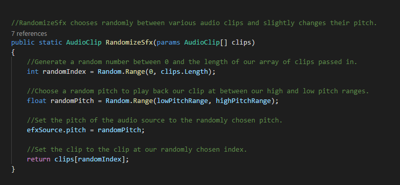

#### Der Zwischenbericht

1. Bitten fügen Sie hier ein neues Kapitel als Zwischenbericht hinzu. Beschreiben Sie welche Teile (welchen Layer) des Spiels sie bisher entwickelt haben, fügen Sie Screenshots hinzu und beschreiben Sie wie der Spieler mit dem Spiel interagiert. 

2. Meine Hoffnung ist, dass Sie bis zum jetzigen Zeitpunkt Layer 2 beendet haben und bereits an Layer 3 arbeiten. 

3. Wenn Sie regelmässig Teile des Entwicklungsprozesses dokumentieren, sollte der Zwischenbericht sehr einfach zu vervollständigen sein. 
4. Erklären Sie hier auch, welche Teile schwerer oder einfacher zu entwickeln waren, als von Ihnen gedacht. Welche Teile in ihrem Spiel haben sich auf Basis der Implementierung geändert? 

5. Diskutieren Sie die Herausforderungen der Implementierung. Gab es Punkte, die sie sich einfacher vorgestellt hatten und dann aufgrund der komplexen Implementierung aufgeben mussten? 

__Weiteres entnehmen Sie bitte dem Übungsblatt!__

#### Zwischenbericht

Wir haben bisher Layer1 und einige Elemente aus Layer2 implementiert.

##### Layer1:

- 3 Fraktionen mit je einer Einheit.
  Als erstes haben wir eine einzelne Einheit erstellt. Dazu haben wir uns ein kostenloses Gloomy Sprite-Sheet aus dem AssetStore
  heruntergeladen, welches uns auch Animationen ermöglicht.
  
 
 
  Diese dient als Platzhalter, bis wir diese für die einzelnen Fraktionen noch etwas anpassen.
  
  
##### Player Movement:

Das Player Movement hatten wir zu beginn sehr einfach implementiert:

Das hat für die erste Zeit gereicht, jedoch haben wir gemerkt dass es einige Probleme gab, 
die Bewegung hat sich merkwürdig angefühlt und das erklimmen von hohen Klippen war 
"zu einfach", außerdem haben wir informationen benötigt wie zum Beispiel ob wir gerade 
"grounded" sind um Mehrfachsprünge zu verhindern,  Sprunganimationen einzuführen etc.
 Daher haben wir das Movement-Script nach einem recht ausführlichen Unity Tutorial aufgebaut 
 und es ist etwas komplizierter als erwartet geworden.
 
 Dazu haben wir erstmal ein eigenes Physics Object erstellt, von dem der Playercontrollererbt.  
 Die wichtigste Funktion für die Bewegung  ist die Movement Funktion in dem Physics Object:
 
 
 hierbei wird zuerst geschaut ob die mögliche Bewegung groß genug ist um gemacht zu 
 werden. 
 Wenn ja wird mit rb2d.Cast() geschaut ob es während dieser Bewegung zu 
 hits kommen wird. Falls es hits gibt werden diese in einer Hitbufferliste
 zwischengespeichert.
 Mithilfe dieser sehen wir dann auch ob wir "grounded" sind,
 in dem Fall ob wir mit einem Objekt colliden ,dass 
 eine gewisse Steigung nicht übersteigt.
 
 
 
 Zum Schluss wird die neue Position berechnet und angewandt.
 
 
 
 #####  Audio:
 Das hinzufügen von Hintergrundsounds und Soundeffekten ging recht einfach.
 Dabei haben wir uns am Anfang an das Soundcontroller Script, 
 welches wir für unser erstes Breakout Spiel erstellt  hatten. 
 Das erlaubte es uns einfache Sounds abzuspielen, man 
 merkte aber schnell, dass störend ist immer wieder den gleichen 
 Soundeffekt zu hören wenn man zum Beispiel getroffen wird. 
 Deshalb haben wir das Script um eine Funktion RandomizeSfx() erweitert, 
 die zum Beispiel beim hintereinander Getroffen werden  zwischen 
 zufälligen verschiedenen Sounds wechselt und dabei auch eine kleine 
 Varianz in die höhe vom Pitch bringt.
 
 
 ##### Voice Acting:
 Die Stimmen der einzelnen Fraktionen haben wir selbst eingesprochen. Dabei haben wir
 hauptsächlich Auda City für die Aufnahmen benutzt. 

 

  
