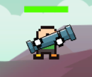
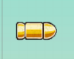
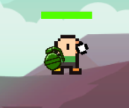
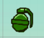

#### Alpha-Release

Seid der Beta haben wir einige neue Änderungen implementiert.
2 neue Waffen sind jetzt im Spiel integriert, darunter eine Bazooka:

Und eine Granate:

Die Bazooka schießt eine Rakakete die einen zusätzlichen Antriebsschub bekommmt. Beim Aufprall instanziert diese eine Explosion
die eine Druckwelle auslößt.
Die Granate hat ein bouncyness-attribut und nach der Collision mit einem Objekt, explodiert sie nach 3 Sekunden.
Für beide Waffen wurden Sounds für das Schießen/Werfen, den Aufprall und die Explosion hinzugefügt.

Desweiteren haben wir eine Zeitbeschränkung für die Bewegung der Spieler pro Zug eingebaut.
Der Spieler hat nun 3 Sekunden Zeit, sich nach dem Drücken des Move-Buttons zu bewegen.

Das UI hat nun eine Gewinnbenachrichtung, die aufgerufen wird, sobald nur noch ein Spieler am Leben ist.
