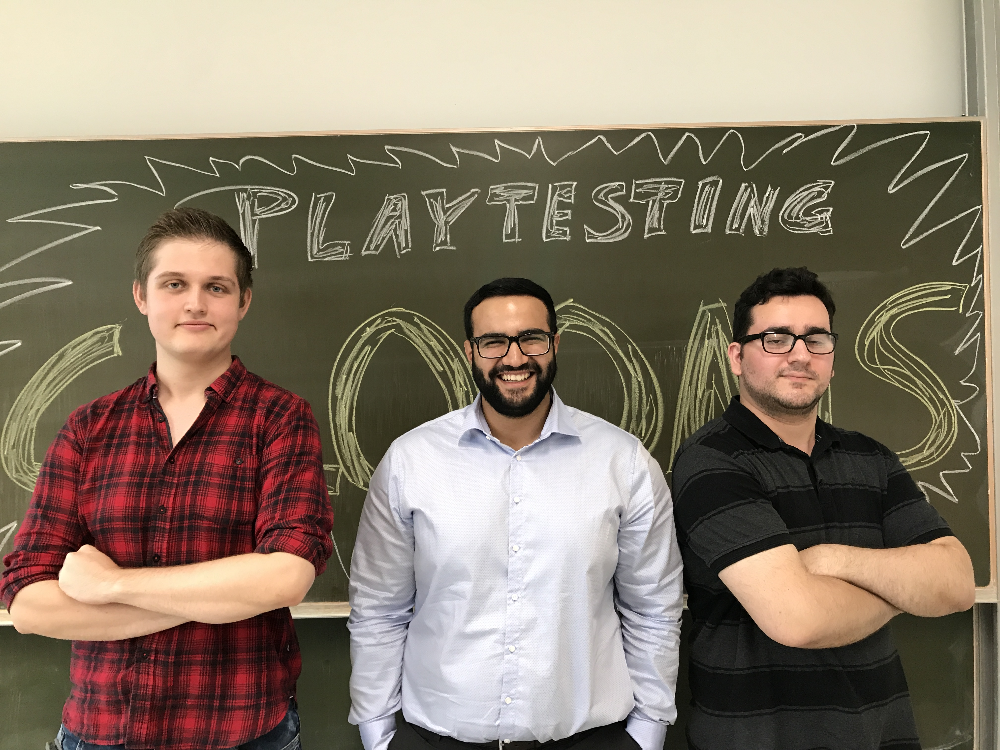
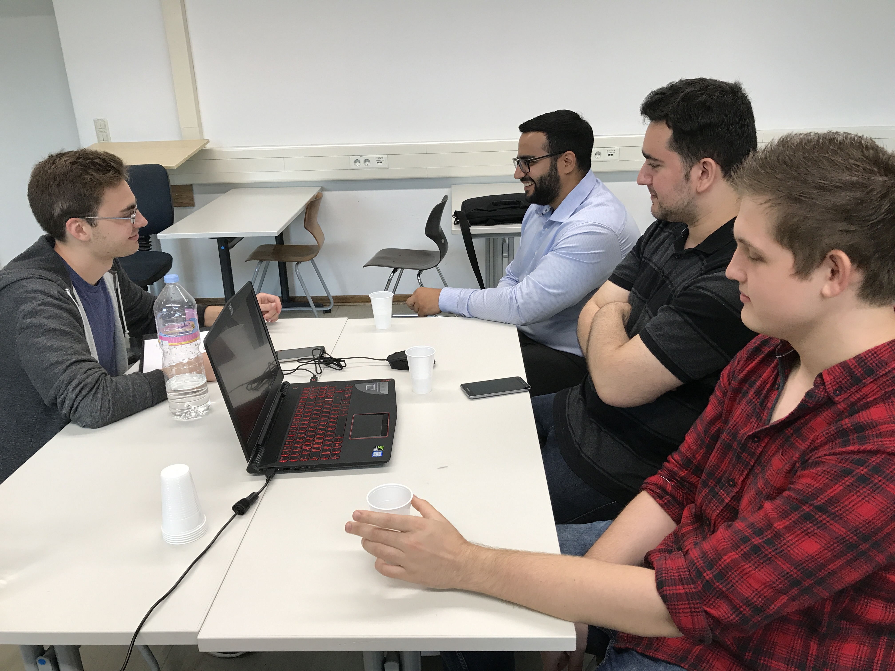
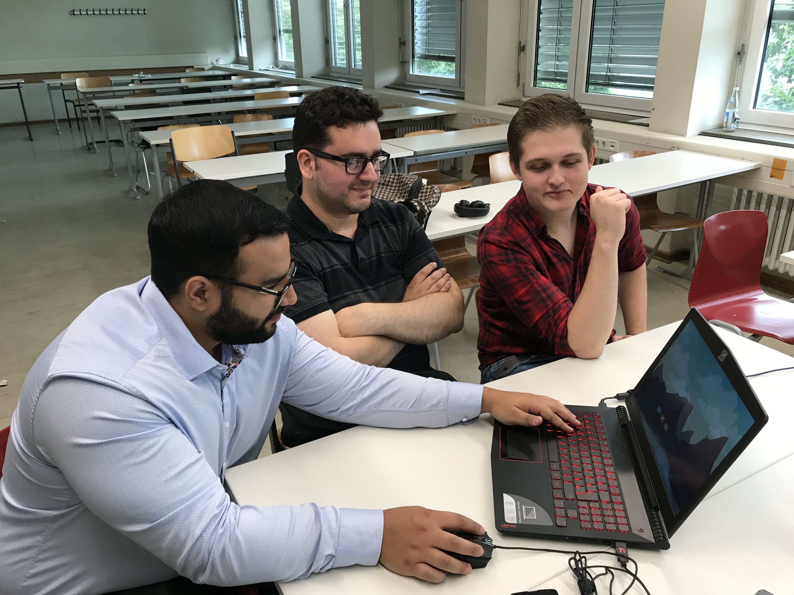

# Playtesting-Auswertung

### Getestete Alpha-Version
Bis kurz vor den Tests haben wir unser Spiel nochmals erweitert.

#### Neurungen
* Kamera wurde hinzugefügt (Zoom, Charakter-/Projektil-Fokus)
* Map wurde vergrößert bzw. hochskaliert
* Waffenschaden wurde angepasst, balanciert
* Movement-Progressbar, zeigt verbleibende Zeit zum Bewegen
* UI-Pfeil, zeigt wer dran ist

&nbsp;

## Die Tester

Eduard D.(l), Sahyoun A.(m), Onur C.(r)

&nbsp;

Bei unseren Testern haben wir uns für erfahrene Gamer aus unterschiedlichen Richtungen entschieden, da Feedback von "Gaming-Experten" uns am meisten vorranbringt und dies auch die Zielgruppe des Spiels ist. 
Jeder der Probanten wurde begrüßt und anschließend befragt, um ein Gamer-Profil zu erstellen. 
Während des Testings wurde für ausreichend Verpflegung gesorgt.

&nbsp;

### Onur C. (24) - "Japan hat mich an den Eiern"
__Genres__
* JRPG
* Beat Em Ups
* Nintendo

__Top 3__
* Yakuza
* Ace Attorney
* Smash-Brothers

__größter Gaming-Erfolg:__ &nbsp; Hat alle 721 Pokémon in Pokémon Sonne und Mond gefangen

__Ein gutes Spiel...__ - hat eine Story, die mich packt

 &nbsp;
 
### Eduard D. (22) -  "Nichts geht über Nier Automata"

__Genres__
* MMORPG's
* Moba's
* Hack'n Slash

__Top 3__
* Nier Automata
* Devil
* Smash-Brothers

__größter Gaming-Erfolg:__ &nbsp; War Co-Leader bei einem internationalen Warframe-Clan mit über 300 aktiven Mitgliedern

__Ein gutes Spiel...__ - hat Charakter und Atmosphäre

&nbsp;

### Sahyoun A. (26) -  "Beim Killen geht es um die Message"

__Genres__
* Ballerspiele
* Moba's
* Sport Spiele
* Minecraft

__Top 3__
* LoL
* CSGO
* PubG

__größter Gaming-Erfolg:__ &nbsp; Ist im Besitz von über 220 League of Legends-Skins

__Ein gutes Spiel...__ - ist fesselnd und motiviert mich

&nbsp;

### Erwartungen ans Spiel

Onur - "Nicht sehr viele, ich kenn euch schon eine lange Zeit..."

Eduard - "Richtiges Action-Spektakel, vergleichbar mit Nier Automata"

Sahyoun - "Soll einen Reiz haben es weiterzuspielen. Nicht zu kompliziert."

&nbsp;

## Das Testing

### Eindrücke des Menüs

Onur - "Menü ist stimmig"

Eduard - "stabiler Gesamteindruck"

Sahyoun - "epic Game", "Ruckler sind cool", "Optionen fehlen"

&nbsp;

Anschließend wurde eine ca. 15 minütige Runde gespielt mit folgendem Ergebnis. 

### Platzierungen
1. Sahyoun
2. Onur
3. Eduard

&nbsp;

### Feedback während des Spielens

__Onur__
* "Stage(Map) ist kacke"
	* mehrere Ebenen wären nett
* Spawns sind nicht fair, sollten frei wählbar sein
* Charaktere sollten mehrere Leben haben
* "Grundidee nicht schlecht, aber noch nicht polished"
* Musik passt nicht wirklich

&nbsp;

__Eduard__
* Wenn die Map rausgezoomt ist und man schießt, ist der Aufladebalken zu klein
* Schussindikator beim Zielen fehlt, Flugrichtung ist schwer erkennbar
* Buttons sollten angepasst bzw. besser platziert werden
* Bogen ist unpassend (im Zusammenhang mit dem großen Schaden)
* Granaten-Physik ist gut
* hat laut eigenen Aussagen nur aufgrund eines Bugs verloren

&nbsp;

__Sahyoun__
* Spiel ist simpel gehalten (einsteigerfreundlich)
* Trennung der Fraktionen fehlt
* Atlantis fehlt (Atlantis wird im Menü geteasert)

&nbsp;

### Feedback nach dem Spielen (Haupt-Kritikpunkte)
__Onur__
* Hinzufügen von neutralen Umgebungselementen (Explosionsfässer, etc.)
	* bietet mehr Taktik und Abwechslung
* Zielhilfe hinzufügen, unklar in welche Richtung das Projektil genau fliegt
* Hinzufügen von einem Teleportier-Item
* Personalisierungsoptionen

&nbsp;

__Eduard__
* Reaktionsmöglichkeiten fehlen
	* bsp.: wenn man umzingelt ist
* Mehr Mobilität einbauen
* Idee: Alle planen ihre Aktionen vorher und die Aktionen werden anschließend zeitgleich ausgeführt

&nbsp;

__Sahyoun__
* zufällige Spawns einbauen für Variation
* Umgebungsvariationen (Sound + Visuell)
* Atlantis bzw. "Under Water"-Thematik umsetzen

&nbsp;

### "Was hat euch vom Spiel am besten gefallen?"

__Onur__ - Der Multiplayer Aspekt

__Eduard__ - Die Mischung aus Grafik und Sound

__Sahyoun__ - Das Siegen fühlt sich gut an, motiviert weiterzuspielen

### Fazit
Das Testing verlief erfolgreich. Wir konnten eine gute Testing Atmosphäre erzeugen, wodurch jeder seine Tester-Rolle auch ernst nehmen und mithilfe seiner Gaming-Erfahrung konstruktives Feedback geben konnte. Beim Spielen kam auch eine leichte kompetetive Stimmung auf, so wurden nachdem Spiel Wortgefechte ausgetauscht und der Gewinner war auch sichtlich erfreut über seinen Sieg. Es wurde auch nachdem Testing hier und da Feedback gegeben, auch Dinge, die einem während des Testings nicht in den Sinn kamen. Das Feedback werden wir aufjedenfall für den weiteren Entwicklungs-Verlauf berücksichtigen.
