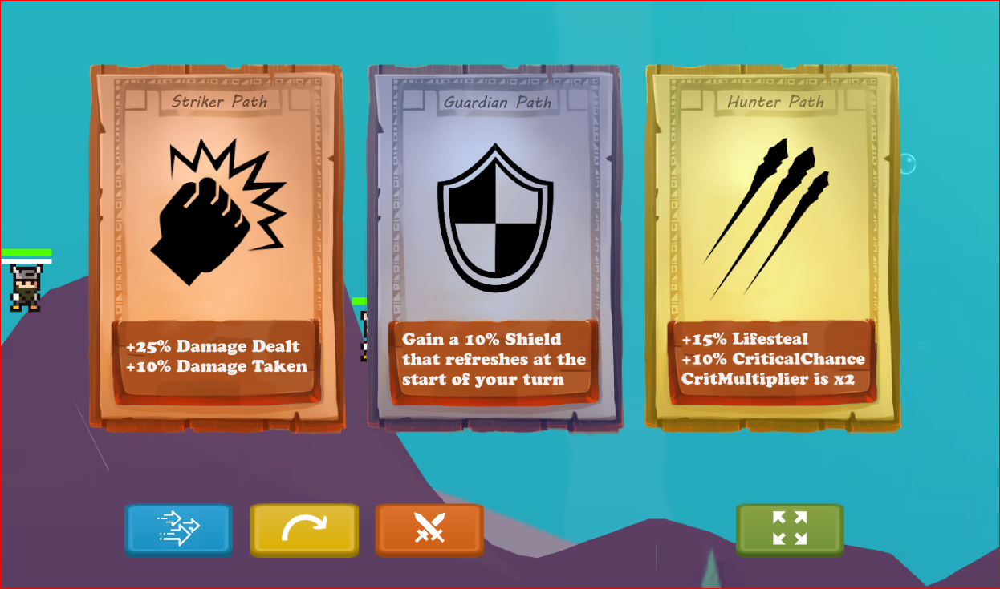
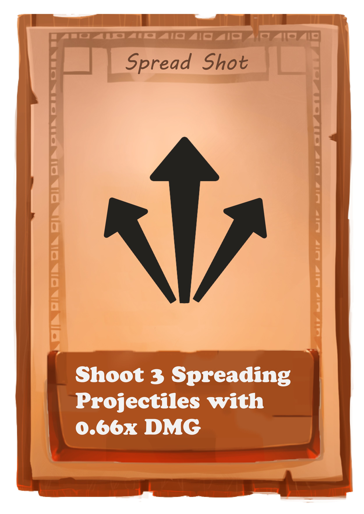
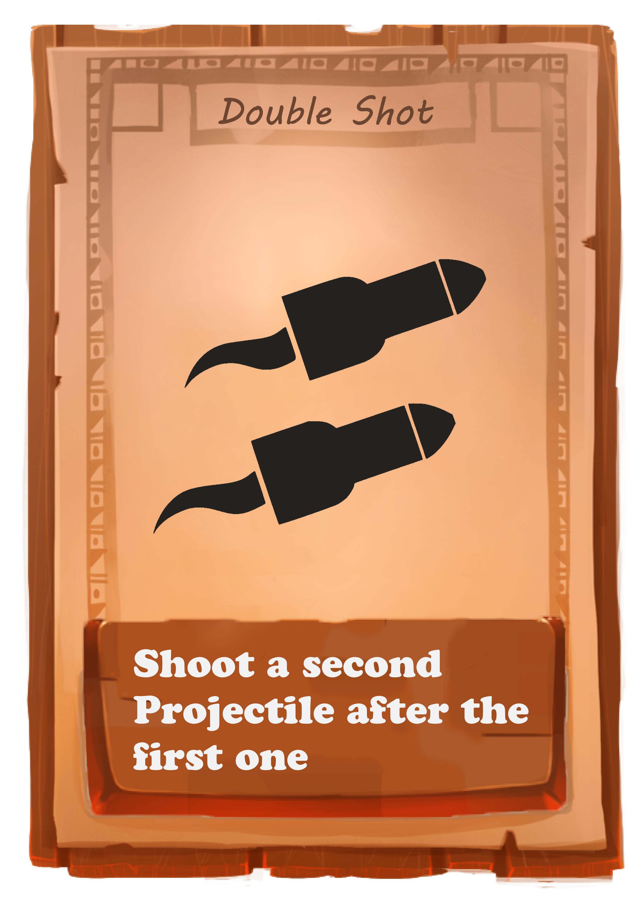
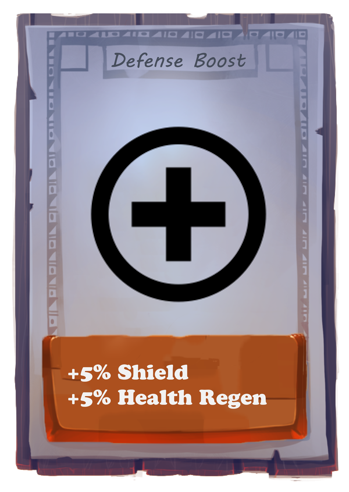
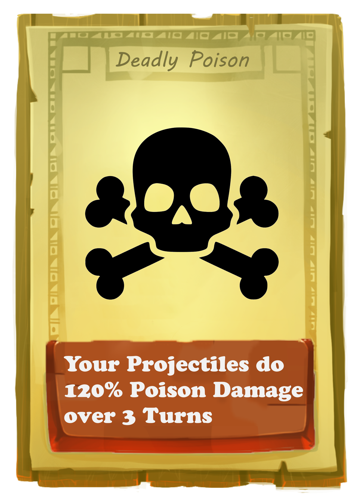
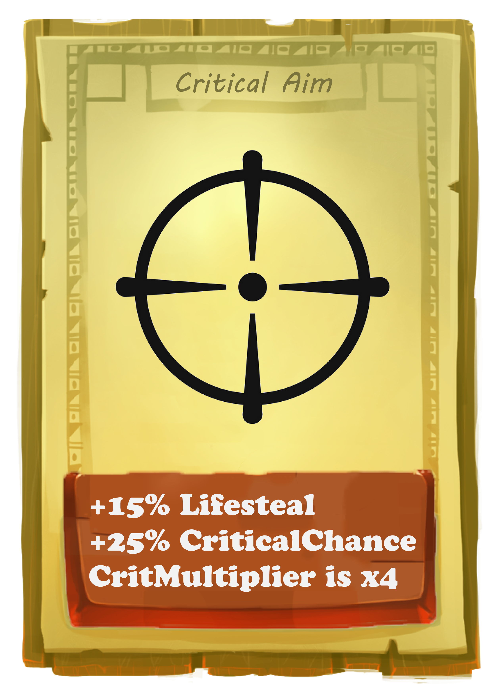
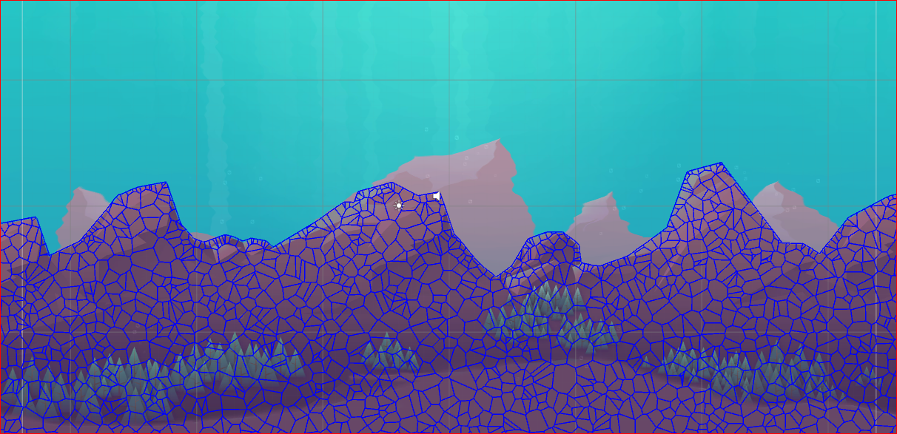
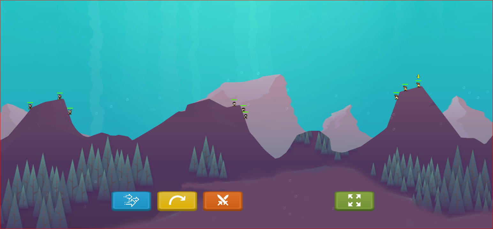

# Finale Auswertung

Seitdem Alpha-Release hat sich viel getan.
## Änderungen nachdem Alpha-Release

### RPG System
Das RPG-System war die umfangreichste Erweiterung unseres Spiels, welche uns zum Schluss die meiste Zeit gekostet hat. Es ist nun möglich durch erfolgreiche Treffer Erfahrung zu sammeln und damit bis zu zwei Stufen zu leveln. Die Waffen geben unterschiedlich viel Erfahrung, mit einer Rakete sind Gegner leichter zu treffen, daher erhält man damit weniger Erfahrung als mit einem Pfeil-Treffer. Hat man genug Erfahrungspunkte gesammelt, erreicht man die erste Stufe und kann sich anschließend für einen von drei Wegen entscheiden:

Zusätzlich zu den angegebenen Werten erhält der Gloomy etwas mehr Leben(+25%).
Sammelt der Gloomy nun weitere Erfahrungspunkte erreicht er die nächste Stufe und kann sich neue Fähigkeiten aussuchen, welche auf dem vorherigen Pfad aufbauen:

Striker-Path

  
   

&nbsp;

Guardian-Path

  
   

&nbsp;

Hunter-Path

  
   

Bei den vollausgebauten Fähigkeiten sollte der Spieler spürbar Veränderungen merken. Das heißt neben passiven Dingen sollten auch neue Spielmechaniken freigeschaltet werden, wie z.B. das Gift, Kritische Treffer oder mehrere Projektile.
Bei einem Levelaufstieg erhält der Gloomy eine Aura mit der entsprechenden Farbe des gewählten Pfades. Beim zweiten Aufstieg erhält die Aura Blitze, damit die anderen Spieler auch wissen, was für ein Gloomy vor ihnen Steht.

### zerstörbare Map + UnderWater-Thematik
Die zerstörbare Map haben wir durch ein Asset erzeugt, welches ein Image in mehrere Teile aufspaltet. Dazu wurde es leicht angepasst, sodass die einzelnen Teile durch Explosionen zerstörbar sind. Beim Aufteilen der Map verändert sich leider auch der Sprite etwas, weshalb sie etwas optisch etwas schwächer aussieht:

Zusätzlich wurde die Map als Unterwasser-Map gestaltet in dem wir den Hintergrund bearbeitet haben und einen UnderWater-Shader darauf angewendet haben:

### Fraktionen: Design/Voicing
Für die Gloomies haben wir 3 Fraktionen entworfen: 

  
   
   

Das Designen hat ebenfalls Zeit beansprucht, da wir nur wenige Pixel zur Verfügung haben um die Charaktere zu gestalten. Außerdem müssen mehrere Bilder pro Charakter angepasst werden, damit auch Animationen möglich sind.

### dynamische Kamera
Die Kamera folgt nun Projektilen und Charakteren, außerdem ist es möglich rauszuzoomen. Bei einem Spielerwechsel wird auch zum jeweiligen Charakter geschwängt.

### mobility-Skill
Da unsere Map nun zerstörbar ist, wurde eine zusätzliche Mobilitäts-Möglichkeit immer wichtiger. Man gelangte zu schnell in Situationen aus denen man nicht mehr rauskam. Daher ist es nun möglich einen großen Sprung zu vollführen, bei dem die Richtung und Stärke bestimmt werden kann.

## Recap des Projekts
Zu Beginn hatten wir etwas getrödelt wodurch wir in Rückstand zu unserem Zeitplan gerieten.
Erstaunlicherweise haben wir gegen Ende der Frist noch die meisten Ziele erfüllen können. Das liegt daran, dass vor allem in den letzten Tagen noch sehr viel entstanden ist (siehe Commit History). Ein Punkt, der es nicht ins Spiel geschafft hat, ist das Action-Point-System. Aus zeitlichen Gründen wurde es während der Entwicklung nie wirklich priorisiert und es ist zudem ein Element, welches vielleicht auch nicht ins Spiel passen würde. 
Ein weiteres Element, welches von der ursprünglichen Idee abweicht, ist die Map bzw. die Story. Ursprünglich sollte es um Atlantis gehen, wir hatten auch bereits ein Menü dafür erstellt, allerdings ist es ziemlich schwierig an Bilder für eine geeignete Map zu kommen. Das Map-Design war generell ein Thema, welches während der Entwicklung immer wieder angeschaut und verschoben wurde. Gegen Ende hin hatten wir uns auf eine Unterwasser-Map geeinigt. Wenn wir heute unser Spiel anschauen sind wir sehr zufrieden mit dem was wir erreicht haben. Es fehlt zwar noch das Polishing, allerdings sind die Ideen, die uns wichtig waren, im Spiel und auch während der Entwicklung hat es jedesmal spaß gemacht wenn ein neues Spiel-Element dazu kam.
Zeit hatten wir genug, allerdings hatten wir nicht diszipliniert genug daran gearbeitet. Sehr viele Elemente sind in den letzten 3 Tagen entstanden, wo wir Tag & Nacht dran saßen. Wir hatten uns dadurch zum Beispiel kaum gedanken daran gemacht, wie wir das Spiel präsentieren. Erst während der Präsentation ist uns aufgefallen, dass unser Spiel auf normaler Länge nicht unbedingt zum Zeigen geeignet ist und das der Build, den wir während der Entwicklung und des Testens genutzt hatten, hierfür besser wäre.
Allzu große technische Schwierigkeiten gab es nicht. Die Umsetzung des UnderWater-Effekts der Map hat jedoch länger gedauert, da wir zu erst einen Shader verwendet hatten, der eine zusätzliche Kamera benötigt. Dadurch wurden jedoch alle Elemente mit gerendered, auch die UI z.B.. Sich mit dem Shader auseinanderzusetzten, hat etwas Zeit beansprucht, am Ende haben wir keine Möglichkeit gefunden ihn auf bestimmte Objekte zu verwenden und haben glücklicherweise einen anderen Shader gefunden. 

&nbsp;

UnderWater als Thema fanden wir sehr unterhaltsam. Auch wenn unsere Atlantis Idee es nicht ins Spiel geschafft hat, sind sehr viele lustige Story-Lines daraus entstanden. Auch bei den anderen Projekten war es interessant zusehen, welchen Einfluss das Thema auf das Spiel hatte. Aus unserer Sicht schränkt ein Thema die Freiheit der Entwickler kaum ein, dazu gibt es zu viele Möglichkeiten ein Spiel zu gestalten. Es schafft eher einen Rahmen, den man eventuell sogar brauch. 
Fürs nächste Projekt würden wir am meisten die Organisation ändern. Wir hatten zwar ein Projektfaden zu Beginn des Semesters gemacht, jedoch wurden kaum Deadlines während des Entwicklungszeitraums gesetzt. Es wurde nur selten Ziele für die nächste Woche besprochen und es kam manchmal auch zu Missverständnissen bei der Umsetzung einelner Elemente. 
Am meisten gefällt uns an unserem Projekt, dass es aus der spielmechanischen Sicht unserem Wunsch-Ziel sehr nahe kommt. Es ist ein Spiel, welches uns sehr gefällt und spaß gemacht hat zu entwickeln. Das Projekt an sich war schon ein Erfolg, da wir neben dem Entwickeln des Spiels, auch vieles über unserere Arbeitsweise und unseren Fehlern lernen konnten. Man hat im Studium nur selten die Aufgabe ein ganzes Projekt aufzusetzen, von der Konzeption bis zum Trailer.
Verbessern könnte man, soweit möglich, die Inhalte der Vorlesung den Übungen mehr anzupassen. 
Eventuell auch zeigen was mit Unity alles möglich ist. 

&nbsp;

Unity als Engine war sehr angenehm. Nachdem man den Aufbau verstanden hat, funktioniert das Integrieren von Spiel-Elementen relativ einfach, zumindest bei einem 2D-Spiel. Man hat sehr schnell das Gefühl vertraut mit Unity zu sein. 
